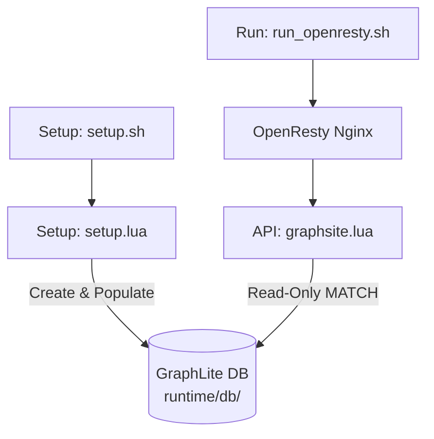
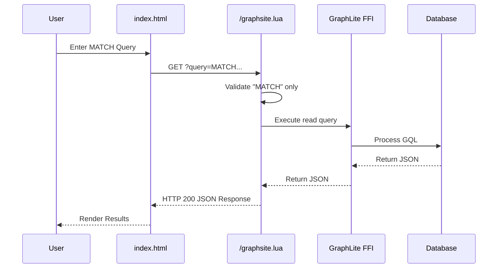

# OpenResty + GraphLite (LuaJIT FFI) Demo

This demo targets OpenResty Lua with **read-only** GQL queries for use cases of graph queries in API gateways handling complex authorization graphs, fast edge routing based on relational data, or caching/serving embedded graph queries at the edge. 

All database operations and logs are strictly confined to a `.gitignore`d `runtime/` directory to prevent repository pollution.

## Prerequisites
- **LuaJIT**: Must be true `luajit` (not standard Lua 5.1/5.4)
- **OpenResty**: Minimal version 1.21.0.0
- **GraphLite FFI Library**: Built via `cargo build --release -p graphlite-ffi`

## 1. Setup & Populate
The setup script validates your environment, generates the schema, and populates the database with sample data. This must be run first.
```bash
./setup.sh
```
*Note: `setup.sh` is idempotent. Running it multiple times safely verifies existing writes.*

## 2. Run OpenResty Server
The run script validates the setup, checks the database for readability, and boots OpenResty inside the `runtime/` prefix.
```bash
./run_openresty.sh
```

Once running, navigate to the local URL provided by the script (e.g., `http://127.0.0.1:49152`). The `index.html` file serves as a trivial query console to exercise the read-only OpenResty endpoint.

To reset the demo data, remove the runtime directory and rerun setup:
```bash
rm -rf "$REPO_ROOT/graphlite-ffi/data/luajit"
```

---

## Architecture

### Component Diagram


### Sequence Diagram

